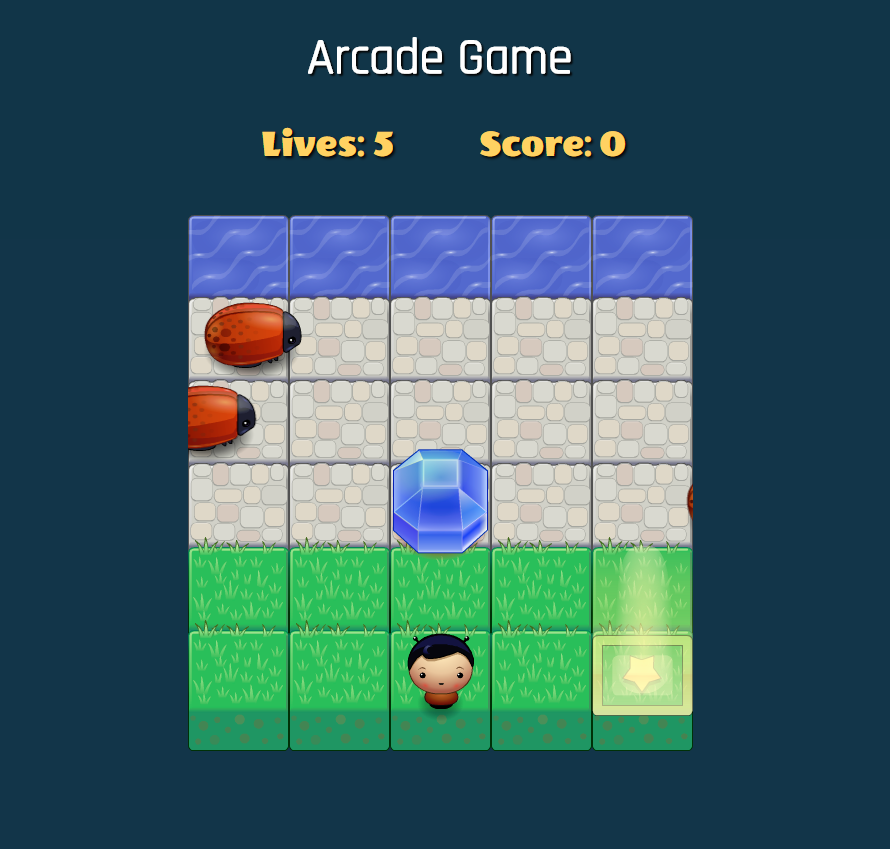

# Arcade Game Project

## Overview
This is Arcade Game for Udacity's Front-End Web Developer Nanodegree project

## How to Run
1. Clone this repository or download and place zip file.
2. open the html file

## How to Play
1. Use the arrow keys to move.
2. The goal is to reach the top of the water and collect gems to get score.
3. After you get 100 score, there will be more bugs. After you get 200 score,
there will be even more bugs.
4. Avoid the bugs, they kill you. You start with five lives.

## Reference
* [HTML5 Canvas Game: 2D Collision Detection](http://blog.sklambert.com/html5-canvas-game-2d-collision-detection/#d-collision-detection)
* [Adding collision detection to images drawn on canvas](https://stackoverflow.com/questions/13916966/adding-collision-detection-to-images-drawn-on-canvas)
* [KeyboardEvent Value (keyCodes, metaKey, etc)](https://css-tricks.com/snippets/javascript/javascript-keycodes/)
